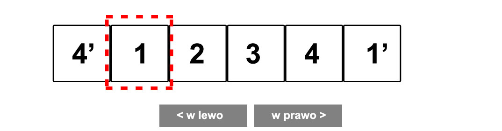
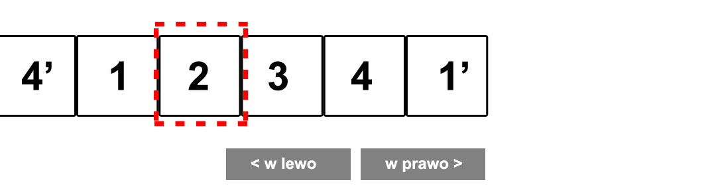
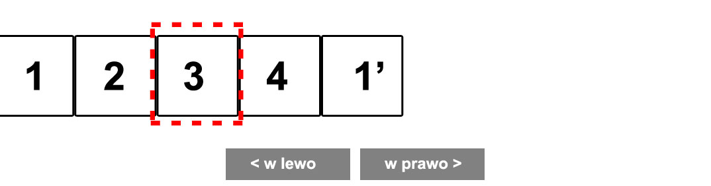
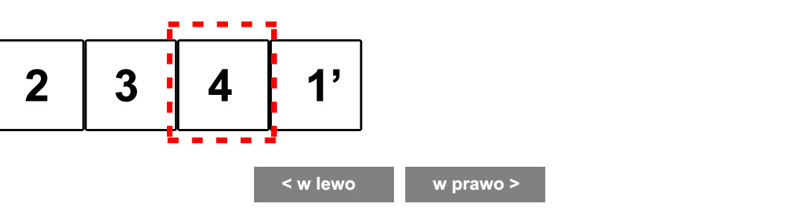
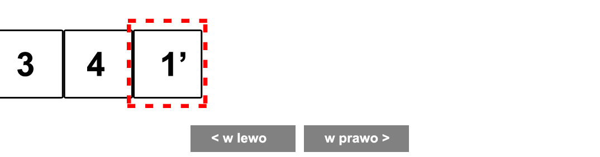

# jQuery &ndash; zadanie
# InfiniteSlider

Napisz slider przerzucający slajdy w nieskończoność, tzn. po ostatnim obrazku wyświetli się pierwszy z nich. Zadanie podzielone jest na punkty. Trzymaj się dokładnie ich treści i rób je po kolei. Po skończeniu zadania pamiętaj o zrobieniu commita.

## Punkt 1
Zapoznaj się z kodem HTML dodanym do zadania. Do zrobienia slidera zazwyczaj musimy odpowiednio dostosować style dla listy, w której znajdują się obrazki. Jeśli zrobiłeś poprzednie zadanie, to przekopiuj część kodu HTML. Dodaj również **klasę** ```slider``` do odpowiedniego elementu w HTML.

## Punkt 2
Przygotuj do pracy plik JavaScript. Dopisz event odpowiedzialny za sprawdzenie, czy DOM został załadowany (pamiętaj, że zadanie masz rozwiązać w jQuery). Sprawdź, czy event działa (np. poprzez wyświetlenie w konsoli napisu "Działa").

Stwórz funkcję, która będzie odpowiedzialna za cała animację slidera. Pamiętaj o odpowiednich komentarzach i właściwej nazwie dla funkcji.

W stworzonej funkcji znajdź następujące elementy i zapisz je do zmiennych (takie same jak w poprzednim zadaniu):

1. Guzik `Next`.
2. Guzik `Prev`.
3. Wszystkie elementy listy (zapisz do tablicy).
4. Dodaj zmienną liczbową, która będzie określała indeks aktualnie widocznego obrazka (na początku będzie to pierwszy obrazek &ndash; czyli zmienna będzie wskazywała na indeks **0**).
5. Ustaw też kolejną zmienną, która będzie przetrzymywać szerokość jednego obrazka.

Sprawdź, czy wyszukałeś odpowiednie elementy i czy ich liczba się zgadza. Wypisz zmienne w konsoli, aby upewnić się, czy zawierają poprawne dane.

## Punkt 3
Stwórz zmienne, do których sklonujesz pierwszy i ostatni element listy, i od razu wstaw je w następujący sposób:
* pierwszy element sklonuj i wstaw na sam koniec listy,
* ostatni element sklonuj i wstaw go na początek listy.

### W jakim celu klonujemy te elementy?

Wyobraź sobie, że mamy slider składający się z czterech obrazków. Przyjrzyj się dokładnie poniższym rysunkom.

1. Pozycja wyjściowa:

  

2. Po kliknięciu w przycisk ```Next``` następuje przesunięcie całego kontenera o szerokość obrazka:

  

3. Po kliknięciu w przycisk ```Next``` następuje przesunięcie całego kontenera o szerokość obrazka:

  

4. Po kliknięciu w przycisk ```Next``` następuje przesunięcie całego kontenera o szerokość obrazka.

  

4. Po kliknięciu w przycisk ```Next``` następuje przesunięcie na sklonowany element pierwszy i od razu niezauważalny powrót na element pierwszy.

  
  

## Punkt 4
Wracamy do naszego kodu.
Ustaw w funkcji szerokość kontenera **ul** na podstawie danych, które przetrzymują Twoje zmienne, tak aby wszystkie obrazki mieściły się obok siebie (pamiętaj, aby usunąć szerokość kontenera z pliku CSS).

## Punkt 5
Dodaj do przycisku ```Next``` event, który zareaguje na kliknięcie (nie używaj pętli &ndash; pamiętaj, że działamy w jQuery). Event na razie ma wyświetlać jakiś tekst w konsoli.

## Punkt 6
Zmodyfikuj event tak, żeby po kliknięciu w przycisk:

1. Zwiększyć zmienną przetrzymującą indeks obrazka.
2. Wykorzystaj funkcję ```animate``` do przesunięcia kontenera **ul** w taki sposób, aby przesunąć kontener i jeżeli jesteśmy ustawieni na ostatnim obrazku  &ndash; automatycznie przesunąć slider na obrazek pierwszy (warunek **if**). Żeby to zrobić, wykorzystaj funkcję ```complete``` w ```animate``` (jeśli nie wiesz jak jej użyć zajrzyj do dokumentacji.) Czyli po skończeniu animacji przesuń slider na pierwszy element.

## Punkt 7
Dodaj drugi event dla przycisku ```Prev```. Wykonaj takie same kroki jak dla eventu ```Next```. Pamiętaj tylko o następujących warunkach:
* zmiennej określającej indeks obrazka w drugą stronę,
* kierunku przesuwania.
Wciąż używamy własności ```left```. Tak samo wykorzystaj funkcję ```complete```.

## Punkt 8
Spróbuj przenieś kod z eventu do funkcji.
Zastanów się, jakie parametry należy do niej przekazać. Ustaw jej odpowiednią nazwę i komentarz.

## Punkt 9
Sprawdź, jak działa Twoja strona. Czy widzisz problemy? Napisz.
